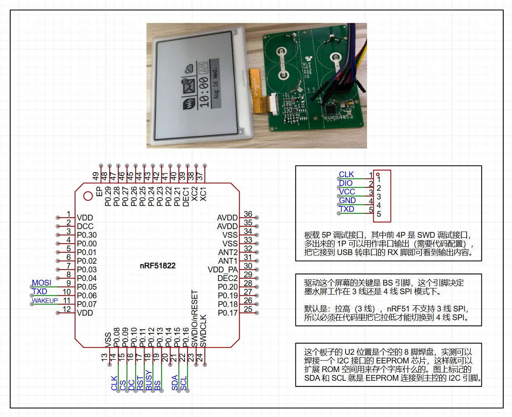
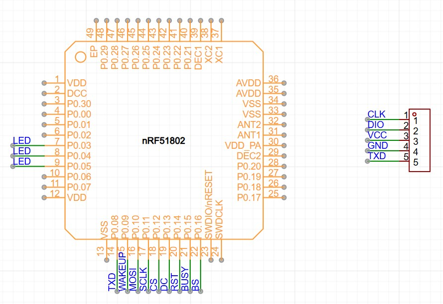
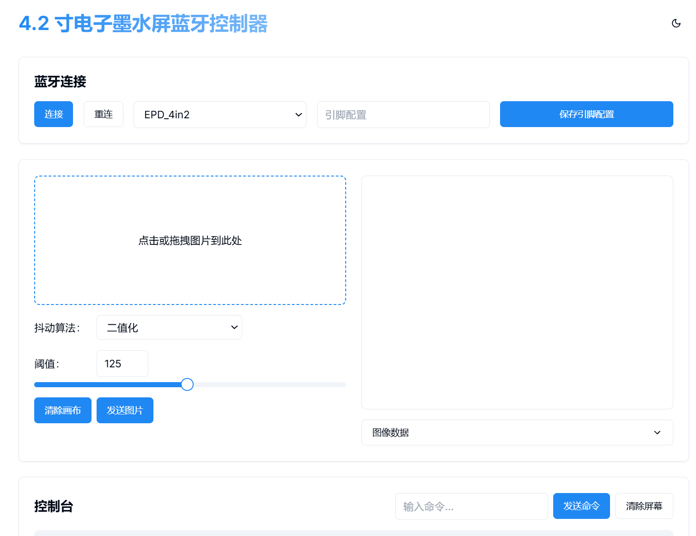

# EPD-nRF51 - 智能电子墨水屏控制器

[](https://github.com/uarix/nRF51-EPD/blob/main/LICENSE)
[](https://github.com/uarix/nRF51-EPD/stargazers)

一款基于 nRF51 系列 MCU 的 4.2 寸电子墨水屏控制器，配备[在线配置工具](https://uarix.github.io/nRF51-EPD/)，支持蓝牙图像传输、多种唤醒方式和灵活的硬件配置。

## ✨ 特性

- 支持全系列 nRF51 MCU
- 内置三款微雪 4.2 寸墨水屏驱动
- 支持自定义引脚映射
- 多种唤醒方式（NFC/无线充电）
- LED 状态指示配置
- 网页版配置工具，无需安装额外软件

## 📱 支持设备

### 黑白双色版本


**硬件规格**
- MCU：nRF51822 (RAM: 16K, ROM: 128K)
- 驱动：EPD_4in2
- 引脚配置：
  ```
  屏幕：0508090A0B0C0D
  线圈：07
  ```

### 黑白红三色版本


**硬件规格**
- MCU：nRF51802 (RAM: 16K, ROM: 256K)
- 驱动：EPD_4in2b_V2
- 引脚配置：
  ```
  屏幕：0A0B0C0D0E0F10
  线圈：09
  LED：03/04/05（三选一）
  ```

> **注意：** 默认配置适用于黑白双色版本，其他型号需要手动调整驱动和引脚映射。

## 🌐 在线配置工具

访问地址：[https://uarix.github.io/nRF51-EPD/](https://uarix.github.io/nRF51-EPD/)



支持在线配置或本地使用（本地部署 `html/index.html`）

## 🛠️ 开发指南

### 环境要求
- Keil 版本：≤ 5.36
  > 由于 nRF51 SDK 仅支持 ARM 编译器 V5 版本，请勿使用更高版本的 Keil。从 5.37 版本开始 Keil 已经不再内置 V5 版本编译器。

### 项目配置
提供三个编译目标：
- `EPD`：生产环境固件
- `EPD-Debug`：开发环境（含日志和 RTT）
- `flash_softdevice`：蓝牙协议栈

### 刷机步骤
1. 擦除全部固件
2. 切换到 `flash_softdevice` 刷入蓝牙协议栈（仅需一次）
3. 切换到 `EPD` 编译并下载

> 在 [Releases](https://github.com/uarix/nRF51-EPD/releases) 页面提供预编译固件

## 🙏 致谢

本项目基于以下开源项目开发：
- 屏幕驱动：[微雪 E-Paper Shield](https://www.waveshare.net/wiki/E-Paper_Shield)
- 蓝牙控制：[atc1441/ATC_TLSR_Paper](https://github.com/atc1441/ATC_TLSR_Paper)
- 原始项目：[tsl0922/EPD-nRF51](https://github.com/tsl0922/EPD-nRF51)

## 📄 许可证

本项目采用 [GPL-3.0 许可证](LICENSE)
